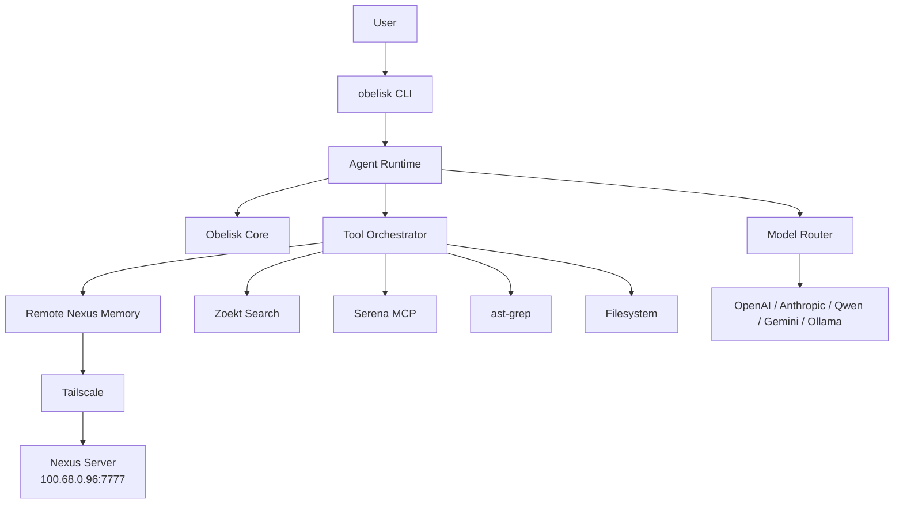

<p align="center">
  <picture>
    <source media="(prefers-color-scheme: dark)" srcset="https://raw.githubusercontent.com/dylmarriner/obelisk-cli/main/.github/assets/obelisk-logo-light.svg">
    
  </picture>
</p>

<p align="center">
  <em>A unified local-first AI coding agent CLI — memory, search, refactor, and orchestration in one tool.</em>
</p>

<p align="center">
  <a href="https://github.com/dylmarriner/obelisk-cli/blob/main/LICENSE"></a>
  <a href="https://github.com/dylmarriner/obelisk-cli/actions/workflows/test.yml"></a>
  <a href="https://nodejs.org/">=22"></a>
  <a href="https://bun.sh"></a>
  <a href="https://www.typescriptlang.org/"></a>
  <a href="https://github.com/dylmarriner/obelisk-cli/graphs/contributors"></a>
  <a href="https://github.com/dylmarriner/obelisk-cli/stargazers"></a>
</p>

---

## Overview

**Obelisk CLI** is a unified local-first AI coding agent platform built on a battle-tested foundation. It combines:

- **Agent shell** — Terminal UI and session runtime (forked from [OpenCode](https://github.com/anomalyco/opencode))
- **Remote memory** — Durable Nexus memory over Tailscale
- **Code intelligence** — Semantic search, structural refactoring, and indexed code navigation
- **Token control** — Budget management, policy enforcement, and prompt assembly
- **Model routing** — Multi-provider support (OpenAI, Anthropic, Qwen, Gemini, Ollama, vLLM, OpenRouter)

> **Design philosophy:** One CLI that can understand a repo, remember decisions, search code fast, refactor safely, manage token budgets, and use remote memory — without becoming seven tools in a trench coat.

---

## Key Features

| Feature | Description |
|---------|-------------|
| **🧠 Persistent Memory** | Remote Nexus memory over Tailscale with offline fallback. Remember decisions, preferences, and task history across sessions. |
| **🔍 Code Search** | Indexed code search via Zoekt — fast trigram-based search across large repositories. |
| **🔧 Semantic Tools** | Symbol-aware code navigation and refactoring via Serena MCP. Find references, rename symbols, understand code structure. |
| **⚡ Structural Refactor** | AST-based pattern matching and rewriting via ast-grep. Safe codemods for large-scale changes. |
| **💰 Token Control** | Obelisk Core enforces budget limits, secret redaction, and execution policies before model calls. |
| **🔄 Multi-Provider** | Route between OpenAI, Anthropic, Qwen, Gemini, Ollama, vLLM, and OpenRouter models. |
| **📡 Tailscale Native** | Secure remote memory access over Tailscale WireGuard with circuit breakers and offline queues. |
| **🔌 Plugin System** | MCP-compatible plugin architecture for extensibility. |

---

## Quick Start

### Prerequisites

- [Node.js](https://nodejs.org/) >= 22
- [Bun](https://bun.sh/) >= 1.3
- [Tailscale](https://tailscale.com/) (for remote memory)

### Installation

```bash
# Install the CLI
curl -fsSL https://obelisk.dev/install | bash

# Verify installation
obelisk --version

# Initialize in a project
obelisk init
```

### Basic Usage

```bash
# Start a session
obelisk run "explain the authentication flow"

# Search code
obelisk search "password reset"

# Find symbol references
obelisk semantic refs AuthService.authenticate

# Structural search
obelisk ast find --lang ts --pattern "await $CALL($ARGS)"

# Check token budget
obelisk budget inspect

# Remember project decisions
obelisk memory remember "This repo uses Prisma with PostgreSQL"

# Recall past context
obelisk memory recall "database migration decisions"
```

### Configuration

```bash
# Set up Nexus remote memory
obelisk nexus config set endpoint http://100.68.0.96:7777

# Check Nexus health
obelisk nexus health

# Set default model
obelisk models set default anthropic/claude-sonnet

# Run diagnostics
obelisk doctor
```

---

## Architecture



For detailed architecture, see [docs/blueprint.md](./docs/blueprint.md).

---

## Component Overview

| Component | Role | Integration |
|-----------|------|-------------|
| [OpenCode](https://github.com/anomalyco/opencode) | Agent shell, TUI, session runtime | Fork base |
| [Nexus](#) | Durable memory server | Remote HTTP over Tailscale |
| [Obelisk Core](./eval/obelisk/) | Token budget, policy, prompt assembly | Native TypeScript package |
| [Serena](https://github.com/oraios/serena) | Semantic code intelligence | MCP server |
| [Zoekt](https://github.com/sourcegraph/zoekt) | Fast code search | Subprocess |
| [ast-grep](https://github.com/ast-grep/ast-grep) | Structural search/refactor | Subprocess |
| [CocoIndex](https://github.com/cocoindex-io/cocoindex) | Incremental AI indexing | Optional plugin (future) |

---

## Documentation

| Document | Description |
|----------|-------------|
| [docs/blueprint.md](./docs/blueprint.md) | Technical architecture, adapter contracts, CLI commands |
| [docs/roadmap.md](./docs/roadmap.md) | Implementation phases, engineering tickets, MVP definition |
| [docs/fork-decision.md](./docs/fork-decision.md) | Fork candidate evaluation and decision matrix |
| [CONTEXT.md](./CONTEXT.md) | Domain language and session runtime specification |
| [SECURITY.md](./SECURITY.md) | Security policy and vulnerability reporting |

### Translated READMEs

| Language | File |
|----------|------|
| Arabic | [README.ar.md](./README.ar.md) |
| Brazilian Portuguese | [README.br.md](./README.br.md) |
| Bosnian | [README.bs.md](./README.bs.md) |
| Danish | [README.da.md](./README.da.md) |
| German | [README.de.md](./README.de.md) |
| Spanish | [README.es.md](./README.es.md) |
| French | [README.fr.md](./README.fr.md) |
| Greek | [README.gr.md](./README.gr.md) |
| Italian | [README.it.md](./README.it.md) |
| Japanese | [README.ja.md](./README.ja.md) |
| Korean | [README.ko.md](./README.ko.md) |
| Norwegian | [README.no.md](./README.no.md) |
| Polish | [README.pl.md](./README.pl.md) |
| Russian | [README.ru.md](./README.ru.md) |
| Thai | [README.th.md](./README.th.md) |
| Turkish | [README.tr.md](./README.tr.md) |
| Ukrainian | [README.uk.md](./README.uk.md) |
| Vietnamese | [README.vi.md](./README.vi.md) |
| Chinese (Simplified) | [README.zh.md](./README.zh.md) |
| Chinese (Traditional) | [README.zht.md](./README.zht.md) |

---

## Project Structure

```
obelisk-cli/
  apps/
    cli/                  # Main CLI binary
    desktop/              # Desktop application
    mcp-server/           # MCP server
  packages/
    core/                 # Agent runtime, orchestrator, tool router
    obelisk-core/         # Token budget, policy, prompt assembly
    adapters/             # Memory, search, semantic, structural adapters
    plugins/              # Plugin system
    security/             # Tailnet access, permissions, API key management
    shared/               # Types, config, logging, utilities
  docs/                   # Architecture and design documentation
  specs/                  # API specifications and design docs
  eval/                   # Evaluated component repositories
  scripts/                # Build and utility scripts
```

---

## Development

### Setting Up

```bash
git clone https://github.com/dylmarriner/obelisk-cli.git
cd obelisk-cli
bun install
```

### Available Commands

```bash
bun run dev              # Start development server
bun run dev:desktop      # Start desktop app
bun run dev:web          # Start web app
bun run lint             # Run oxlint
bun run typecheck        # Run TypeScript type checking
bun run engine:build     # Build Obelisk Rust engine
```

### Testing

```bash
# Run tests for a specific package
bun run --cwd packages/core test

# Type checking
bun run typecheck
```

---

## Contributing

We welcome contributions! Please see [CONTRIBUTING.md](./CONTRIBUTING.md) for detailed guidelines.

### Quick Guide

1. Fork the repository
2. Create a feature branch (`git checkout -b feat/amazing-feature`)
3. Commit your changes (`git commit -m 'feat: add amazing feature'`)
4. Push to the branch (`git push origin feat/amazing-feature`)
5. Open a Pull Request

### Code of Conduct

This project adheres to the [Contributor Covenant Code of Conduct](./CODE_OF_CONDUCT.md). By participating, you are expected to uphold this code.

---

## Security

See [SECURITY.md](./SECURITY.md) for our security policy and vulnerability disclosure process.

**Key points:**
- Obelisk does not sandbox the agent — run in a container for isolation
- Server mode requires `OBELISK_SERVER_PASSWORD` for authentication
- AI-generated security reports are not accepted and will result in a ban

---

## License

[MIT](./LICENSE) © Obelisk Contributors

---

## Acknowledgments

- [OpenCode](https://github.com/anomalyco/opencode) — The foundation CLI framework
- [Serena](https://github.com/oraios/serena) — Semantic code toolkit
- [Zoekt](https://github.com/sourcegraph/zoekt) — Fast code search engine
- [ast-grep](https://github.com/ast-grep/ast-grep) — Structural code search
- [CocoIndex](https://github.com/cocoindex-io/cocoindex) — Incremental indexing framework