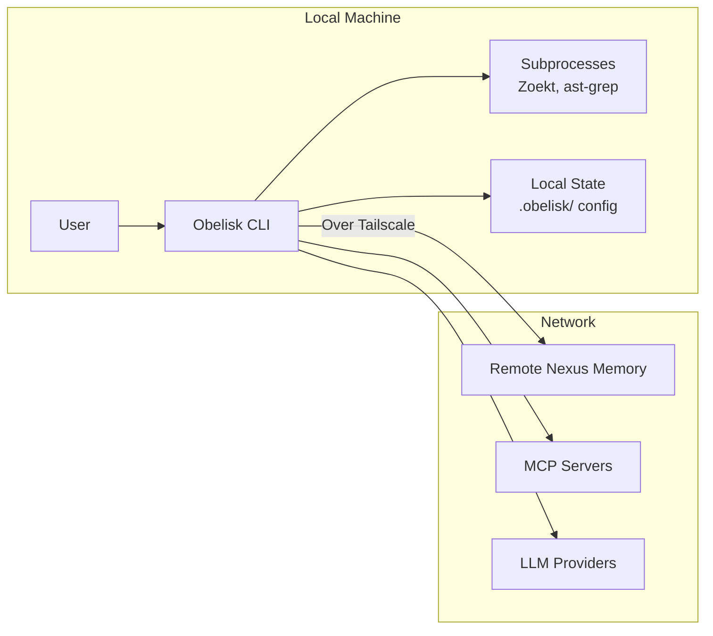

# Security Policy

## Supported Versions

Obelisk CLI follows semantic versioning. Security patches are provided for the latest minor release of the current major version.

| Version | Supported          |
| ------- | ------------------ |
| >= 0.1  | :white_check_mark: |

## Reporting a Vulnerability

### Important Notice

**We do not accept AI-generated security reports.** We receive a large volume of these and lack the resources to review them all. Submitting an AI-generated report will result in an automatic permanent ban from the project.

### Disclosure Process

We take the security of Obelisk CLI seriously. If you believe you have found a security vulnerability, please follow these steps:

1. **Do not** disclose the vulnerability publicly (e.g., via GitHub Issues, Discussions, or social media)
2. **Do not** create a public issue for the vulnerability
3. **Submit** a report via the GitHub Security Advisory tab:
   [Report a Vulnerability](https://github.com/dylmarriner/obelisk-cli/security/advisories/new)
4. **Include** the following information in your report:
   - Type of vulnerability
   - Steps to reproduce
   - Affected versions
   - Potential impact
   - Any suggested mitigation (if known)

### What to Expect

1. **Acknowledgement**: We will acknowledge receipt within 48 hours
2. **Assessment**: We will assess the report within 6 business days
3. **Updates**: We will keep you informed of progress
4. **Resolution**: We will work on a fix and coordinate disclosure

### Escalation

If you do not receive an acknowledgement of your report within 6 business days, you may escalate via email to security@obelisk.dev. Please include the original report details and a reference to the initial submission.

---

## Threat Model

### Overview

Obelisk CLI is an AI-powered coding assistant that runs locally on your machine. It provides an agent system with access to powerful tools including shell execution, file operations, and web access. This threat model outlines the security boundaries and assumptions of the system.

### Trust Boundaries

### No Sandbox

Obelisk CLI does **not** sandbox the agent. The permission system exists as a UX feature to help users stay aware of what actions the agent is taking — it prompts for confirmation before executing commands, writing files, etc. However, it is not designed to provide security isolation.

**If you need true isolation, run Obelisk CLI inside a Docker container or VM.**

### Server Mode

Server mode is opt-in only. When enabled:

- Set `OBELISK_SERVER_PASSWORD` to require HTTP Basic Auth
- Without this password, the server runs unauthenticated (with a warning)
- It is the end user's responsibility to secure the server
- Any functionality it provides is not considered a vulnerability

### Out of Scope

| Category | Rationale |
|----------|-----------|
| **Server access when opted-in** | If you enable server mode, API access is expected behavior |
| **Sandbox escapes** | The permission system is not a sandbox (see above) |
| **LLM provider data handling** | Data sent to your configured LLM provider is governed by their policies |
| **MCP server behavior** | External MCP servers you configure are outside our trust boundary |
| **Malicious config files** | Users control their own config; modifying it is not an attack vector |

---

## Security Best Practices

### For Users

1. **Run in a container** for true isolation: `docker run -it obelisk-cli`
2. **Set `OBELISK_SERVER_PASSWORD`** when using server mode
3. **Review permissions** before approving dangerous commands
4. **Use Tailscale** for remote Nexus memory access
5. **Keep Node.js and Bun updated** to latest versions
6. **Review plugins** before installing from third-party sources

### For Developers

1. **Never commit secrets** — use environment variables or `.env` files
2. **Never send sensitive data** to remote memory by default
3. **Add policy checks** for all dangerous operations (shell, file write, network)
4. **Redact secrets** in logs and memory records
5. **Use HTTPS or Tailscale** for remote connections
6. **Validate all external input** from MCP servers and plugins
7. **Keep dependencies updated** — use `bun update` regularly

### Data Classification

| Classification | Examples | Handling |
|---------------|----------|----------|
| Public | Code, documentation, config | Can be sent to Nexus, LLMs |
| Private | Environment variables, API keys | Redacted before sending |
| Secret | SSH keys, credentials, tokens | Never sent to remote services |

---

## Vulnerability Disclosure Timeline

| Phase | Timeframe | Description |
|-------|-----------|-------------|
| Report | Day 0 | Vulnerability reported via GitHub Security Advisory |
| Acknowledgement | < 48 hours | Team acknowledges receipt |
| Assessment | < 6 business days | Team assesses severity and impact |
| Fix | Varies | Team develops and tests a fix |
| Embargo | 90 days max | Coordinated disclosure period |
| Public Disclosure | After embargo | Vulnerability publicly disclosed |

---

## Security Features

| Feature | Description | Status |
|---------|-------------|--------|
| Secret redaction | Automatic detection and redaction of secrets in logs | :white_check_mark: |
| Dangerous command approval | User confirmation required for shell/file operations | :white_check_mark: |
| Server password auth | HTTP Basic Auth for server mode | :white_check_mark: |
| Offline memory queue | Local cache when Nexus is unreachable | :white_check_mark: |
| File access policy | Deny access to `.env`, private keys, etc. | :white_check_mark: |
| Permission boundaries | Per-project and per-operation permission policies | :white_check_mark: |
| Circuit breaker | Disable remote writes after repeated failures | :white_check_mark: |

---

## Acknowledgments

We thank the security researchers and community members who have responsibly disclosed vulnerabilities to us. Your contributions help keep the project safe for everyone.