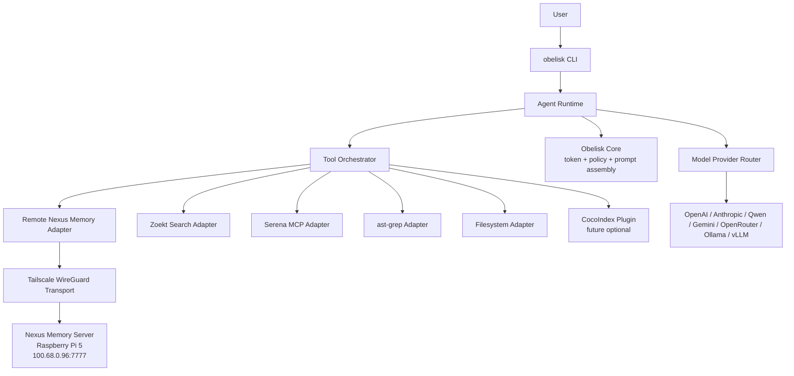

# Obelisk CLI Technical Blueprint

> Execution-ready architecture based on OpenCode fork, TypeScript, local-first design, remote Nexus memory over Tailscale.

---

## 1. Product definition

**Obelisk CLI** is a unified local-first AI coding agent CLI.

It combines:

| Layer                | Component                                |
| -------------------- | ---------------------------------------- |
| Agent shell          | OpenCode fork (see [fork-decision.md](./fork-decision.md)) |
| Remote memory        | Nexus over Tailscale                     |
| Token/control layer  | Obelisk Core                             |
| Semantic code tools  | Serena MCP                               |
| Fast code search     | Zoekt                                    |
| Structural refactor  | ast-grep                                 |
| Future indexing/sync | CocoIndex plugin                         |
| Model routing        | OpenCode provider layer + Obelisk policy |

**Base fork:** `anomalyco/opencode` — MIT licensed, TypeScript-heavy, terminal-first, with built-in agent modes, model/provider infrastructure, config, sessions, and strong community activity.

**Binary:** `obelisk`

**Repo:** `dylmarriner/obelisk-cli`

---

## 2. Core architecture



### Design rule

OpenCode remains the **interactive shell and session runtime**. Your added architecture lives around it as **clear adapters**, not random hacked-in functions buried in the command loop.

---

## 3. Fork strategy

### Base repository

```bash
git clone https://github.com/anomalyco/opencode.git obelisk-cli
cd obelisk-cli
```

### Fork changes

| Area            | Change                                                                                                       |
| --------------- | ------------------------------------------------------------------------------------------------------------ |
| Binary          | Rename from `opencode` to `obelisk`                                                                          |
| Config file     | Add `obelisk.config.jsonc`                                                                                   |
| Local state     | Add `.obelisk/`                                                                                              |
| Packages        | Add adapter packages under `packages/obelisk-*`                                                              |
| Commands        | Add `obelisk nexus`, `obelisk memory`, `obelisk search`, `obelisk ast`, `obelisk semantic`, `obelisk budget` |
| Prompt pipeline | Insert Obelisk Core before model calls                                                                       |
| Tool routing    | Add orchestration layer that chooses Nexus, Zoekt, Serena, ast-grep, filesystem                              |
| Plugin layer    | Keep OpenCode plugin/MCP compatibility, add Obelisk plugin manifest                                          |

---

## 4. Repo structure

```txt
obelisk-cli/
  apps/
    cli/
      src/
        main.ts
        commands/
          init.ts
          run.ts
          doctor.ts
          nexus.ts
          memory.ts
          search.ts
          ast.ts
          semantic.ts
          budget.ts
          models.ts
          tailnet.ts
        tui/
        session/

  packages/
    core/
      src/
        AgentRuntime.ts
        AgentOrchestrator.ts
        ToolRouter.ts
        ContextAssembler.ts
        SessionManager.ts
        ProjectIdentity.ts

    obelisk-core/
      src/
        TokenBudgetManager.ts
        PromptAssembler.ts
        PolicyEngine.ts
        SecretRedactor.ts
        ExecutionGuard.ts

    adapters/
      memory/
        src/
          MemoryAdapter.ts
          RemoteNexusMemoryAdapter.ts
          LocalMemoryCache.ts
          MemoryTypes.ts

      search/
        src/
          SearchAdapter.ts
          ZoektSearchAdapter.ts

      semantic/
        src/
          SemanticCodeAdapter.ts
          SerenaMcpAdapter.ts

      structural/
        src/
          StructuralRefactorAdapter.ts
          AstGrepAdapter.ts

      indexer/
        src/
          IndexerAdapter.ts
          ZoektIndexerAdapter.ts
          CocoIndexAdapter.ts

      models/
        src/
          ModelProviderAdapter.ts
          OpenCodeModelAdapter.ts

    plugins/
      src/
        PluginLoader.ts
        PluginManifest.ts
        PluginRegistry.ts

    security/
      src/
        TailnetAccessChecker.ts
        PermissionBoundary.ts
        FileAccessPolicy.ts
        ApiKeyManager.ts

    shared/
      src/
        Result.ts
        Logger.ts
        Config.ts
        Errors.ts

  docs/
    architecture.md
    nexus-memory.md
    adapter-contracts.md
    tailscale-security.md
    roadmap.md

  examples/
    obelisk.config.jsonc
    .env.example
    tailscale-acl.json
```

---

## 5. Adapter contracts

### `MemoryAdapter`

```ts
export interface MemoryAdapter {
  health(): Promise<MemoryHealth>;
  remember(input: MemoryWrite): Promise<MemoryRecord>;
  recall(query: MemoryQuery): Promise<MemoryRecord[]>;
  get(id: string): Promise<MemoryRecord | null>;
  forget(input: MemoryForgetRequest): Promise<MemoryForgetResult>;
  saveDecision(input: ArchitecturalDecision): Promise<MemoryRecord>;
  saveTaskHistory(input: TaskHistoryRecord): Promise<MemoryRecord>;
  syncOfflineQueue(): Promise<MemorySyncResult>;
}
```

### `RemoteNexusMemoryAdapter` config

```ts
export interface RemoteNexusMemoryAdapterConfig {
  endpoint: string;
  apiKeyEnv: string;
  healthPath: string;
  timeoutMs: number;
  healthTimeoutMs: number;
  retries: number;
  retryBackoffMs: number[];
  offlineCachePath: string;
  syncOnReconnect: boolean;
}
```

### `SearchAdapter`

```ts
export interface SearchAdapter {
  index(input: IndexRequest): Promise<IndexResult>;
  search(input: SearchQuery): Promise<SearchResult[]>;
  status(input: IndexStatusRequest): Promise<IndexStatus>;
  rebuild(input: RebuildIndexRequest): Promise<IndexResult>;
}
```

### `SemanticCodeAdapter`

```ts
export interface SemanticCodeAdapter {
  status(): Promise<SemanticToolStatus>;
  listSymbols(input: ListSymbolsRequest): Promise<CodeSymbol[]>;
  findSymbol(input: FindSymbolRequest): Promise<CodeSymbol[]>;
  findReferences(input: FindReferencesRequest): Promise<CodeReference[]>;
  prepareRename(input: RenameSymbolRequest): Promise<EditPlan>;
  applyEditPlan(input: ApplyEditPlanRequest): Promise<ApplyResult>;
}
```

### `StructuralRefactorAdapter`

```ts
export interface StructuralRefactorAdapter {
  find(input: StructuralFindRequest): Promise<StructuralMatch[]>;
  rewrite(input: StructuralRewriteRequest): Promise<RewritePreview>;
  scan(input: StructuralScanRequest): Promise<StructuralIssue[]>;
  apply(input: ApplyRewriteRequest): Promise<ApplyResult>;
}
```

### `TokenControlAdapter`

```ts
export interface TokenControlAdapter {
  inspect(input: ContextCandidate): Promise<TokenReport>;
  assemble(input: PromptAssemblyRequest): Promise<PromptAssemblyResult>;
  enforcePolicy(input: AgentAction): Promise<PolicyDecision>;
  compact(input: ContextCompactionRequest): Promise<CompactedContext>;
}
```

### `IndexerAdapter`

```ts
export interface IndexerAdapter {
  init(input: IndexerInitRequest): Promise<IndexerStatus>;
  update(input: IndexerUpdateRequest): Promise<IndexUpdateResult>;
  watch(input: IndexerWatchRequest): AsyncIterable<IndexEvent>;
  status(input: IndexerStatusRequest): Promise<IndexerStatus>;
}
```

---

## 6. Integration plan by component

### OpenCode

**Role:** main shell, TUI, session runtime, provider handling, base coding agent workflow.

**Integration type:** native fork.

**Modification points:**
- CLI command registry
- config loader
- model provider call path
- tool registry
- session lifecycle
- permissions/hooks
- agent mode definitions

### Nexus

**Role:** durable memory.

**Integration type:** native TypeScript HTTP adapter.

Treat Nexus as a **remote service**, not a local dependency. The CLI should access it over `http://100.68.0.96:7777` through Tailscale.

**Stores:**

| Memory               | Scope                              | Remote?         |
| -------------------- | ---------------------------------- | --------------- |
| user preferences     | global                             | yes             |
| project decisions    | project                            | yes             |
| repo summary         | project                            | yes             |
| task history         | project/session                    | yes             |
| active session notes | session                            | yes, summarized |
| raw source files     | local only                         | no              |
| secrets              | never                              | no              |
| embeddings           | Nexus or future local vector store | later           |

### Obelisk Core

**Role:** token budget, prompt assembly, control policy, execution permissions.

**Integration type:** native package.

Obelisk must sit before model calls and tool execution:

```txt
User request
  -> classify
  -> retrieve memory/search context
  -> Obelisk budget inspect
  -> Obelisk compact/assemble
  -> model call
  -> tool action
  -> Obelisk policy check
  -> execution
```

**Responsibilities:**
- Token budget inspection
- Tool result compaction
- Secret redaction
- Permission boundaries
- Dangerous command blocking
- Prompt assembly
- Context prioritization
- "Do not send this to remote model" rules

### Serena

**Role:** semantic code intelligence.

**Integration type:** MCP server.

**Use for:**
- Find symbol
- Find references
- Symbol-aware edits
- Rename planning
- Code navigation in large repos
- Semantic understanding beyond plain search

**Do not use Serena for:**
- Fast keyword search
- Repo-wide regex
- Simple file reads
- Bulk mechanical rewrites where ast-grep is safer

### Zoekt

**Role:** fast indexed code search.

**Integration type:** subprocess first, optional local daemon later.

**Commands to wrap:**
```bash
zoekt-index
zoekt-git-index
zoekt
zoekt-webserver
```

**Use for:**
- "Where is this implemented?"
- Exact search
- Regex search
- Large repo discovery
- Search result narrowing before filesystem reads

### ast-grep

**Role:** structural search and refactoring.

**Integration type:** subprocess first, Node NAPI later.

**Use for:**
- Pattern-based code search
- Safe codemods
- Bulk refactors
- Static-analysis-like checks
- Migration rules

### CocoIndex

**Role:** future optional ingestion/sync layer.

**MVP decision:** not core.

**Use later for:**
- Incremental embeddings
- Repo-to-memory sync
- Multi-repo knowledge ingestion
- Fresh codebase RAG
- Documentation ingestion
- Nexus enrichment pipeline

---

## 7. Configuration design

### `obelisk.config.jsonc`

```jsonc
{
  "$schema": "https://obelisk.dev/schema/obelisk.config.json",

  "project": {
    "name": "example-project",
    "root": ".",
    "localFirst": true
  },

  "nexus": {
    "enabled": true,
    "endpoint": "http://100.68.0.96:7777",
    "transport": "tailscale",
    "apiKeyEnv": "NEXUS_API_KEY",
    "healthPath": "/health",
    "timeoutMs": 5000,
    "healthTimeoutMs": 1500,
    "retries": 3,
    "retryBackoffMs": [250, 750, 1500],
    "offlineCachePath": ".obelisk/cache/memory-outbox.sqlite",
    "syncOnReconnect": true,
    "circuitBreaker": {
      "enabled": true,
      "failureThreshold": 5,
      "cooldownMs": 300000
    }
  },

  "obelisk": {
    "tokenControl": {
      "enabled": true,
      "maxInputTokens": 120000,
      "reserveOutputTokens": 12000,
      "maxToolResultTokens": 24000,
      "contextPolicy": "compact-first"
    },
    "policy": {
      "denySecretFiles": true,
      "requireApprovalForDangerousCommands": true,
      "blockEnvFileUpload": true,
      "blockPrivateKeyUpload": true,
      "allowFilesystemWrites": true,
      "allowShellCommands": "approval-required"
    }
  },

  "tools": {
    "zoekt": {
      "enabled": true,
      "mode": "subprocess",
      "indexPath": ".obelisk/index/zoekt",
      "autoIndex": true,
      "binary": "zoekt"
    },
    "serena": {
      "enabled": true,
      "mode": "mcp",
      "command": "uvx",
      "args": [
        "--from",
        "git+https://github.com/oraios/serena",
        "serena",
        "start-mcp-server"
      ]
    },
    "astGrep": {
      "enabled": true,
      "mode": "subprocess",
      "binary": "ast-grep"
    },
    "cocoIndex": {
      "enabled": false,
      "mode": "plugin",
      "purpose": "future-incremental-indexing"
    }
  },

  "models": {
    "default": "anthropic/claude-sonnet",
    "fast": "qwen/qwen-coder",
    "cheap": "openrouter/qwen-coder",
    "local": "ollama/qwen2.5-coder",
    "providers": {
      "anthropic": {
        "apiKeyEnv": "ANTHROPIC_API_KEY"
      },
      "openai": {
        "apiKeyEnv": "OPENAI_API_KEY"
      },
      "qwen": {
        "apiKeyEnv": "DASHSCOPE_API_KEY"
      },
      "openrouter": {
        "apiKeyEnv": "OPENROUTER_API_KEY"
      },
      "ollama": {
        "baseUrl": "http://localhost:11434"
      }
    }
  }
}
```

### `.env.example`

```bash
NEXUS_ENDPOINT=http://100.68.0.96:7777
NEXUS_API_KEY=replace_with_long_random_value
NEXUS_TIMEOUT_MS=5000
NEXUS_HEALTH_TIMEOUT_MS=1500
NEXUS_RETRIES=3
NEXUS_OFFLINE_CACHE=.obelisk/cache/memory-outbox.sqlite

ANTHROPIC_API_KEY=
OPENAI_API_KEY=
DASHSCOPE_API_KEY=
OPENROUTER_API_KEY=

OBELISK_MAX_INPUT_TOKENS=120000
OBELISK_RESERVE_OUTPUT_TOKENS=12000
OBELISK_REQUIRE_APPROVAL_FOR_DANGEROUS_COMMANDS=true
```

---

## 8. CLI command design

### Core

```bash
obelisk init
obelisk doctor
obelisk run "add password reset flow"
obelisk run --plan "inspect auth system"
obelisk run --continue
obelisk run --offline
```

### Nexus

```bash
obelisk nexus config set endpoint http://100.68.0.96:7777
obelisk nexus config get
obelisk nexus health
obelisk nexus ping
obelisk nexus test-write
obelisk nexus verify-persistence
obelisk nexus sync
```

### Tailscale

```bash
obelisk tailnet status
obelisk tailnet ping 100.68.0.96
obelisk tailnet check nexus
```

### Memory

```bash
obelisk memory remember "This repo uses Prisma and Next.js app router"
obelisk memory recall "database migration decisions"
obelisk memory decisions
obelisk memory task-history
obelisk memory forget "old deployment strategy"
obelisk memory offline-status
```

### Search

```bash
obelisk index
obelisk index status
obelisk index rebuild
obelisk search "createUser"
obelisk search --regex "await .*\\.save\\("
obelisk search --file "auth"
```

### Semantic

```bash
obelisk semantic status
obelisk semantic symbols
obelisk semantic find-symbol UserService
obelisk semantic refs UserService.createUser
obelisk semantic rename createUser registerUser
```

### Structural

```bash
obelisk ast find --lang ts --pattern "await $CALL($ARGS)"
obelisk ast rewrite --lang ts --pattern "var $A = $B" --rewrite "let $A = $B"
obelisk ast scan
```

### Budget / policy

```bash
obelisk budget inspect
obelisk budget explain
obelisk budget compact
obelisk policy show
obelisk policy test "edit .env"
```

### Models

```bash
obelisk models list
obelisk models providers
obelisk models set default anthropic/claude-sonnet
obelisk models set fast qwen/qwen-coder
obelisk models set local ollama/qwen2.5-coder
```

---

## 9. Remote Nexus memory over Tailscale

### Connection strategy

The CLI should always treat Nexus as remote:

```txt
RemoteNexusMemoryAdapter
  -> HTTP client
  -> Tailscale IP 100.68.0.96
  -> Nexus service port 7777
```

### Health check

```http
GET http://100.68.0.96:7777/health
Authorization: Bearer $NEXUS_API_KEY
```

Expected response:

```json
{
  "ok": true,
  "service": "nexus",
  "version": "0.1.0",
  "storage": "ready"
}
```

### Retry behavior

| Operation          | Timeout | Retries |
| ------------------ | ------: | ------: |
| Health check       |  1500ms |       1 |
| Read memory        |  5000ms |       3 |
| Write memory       |  8000ms |       3 |
| Sync offline queue | 10000ms |       3 |

Backoff: `250ms -> 750ms -> 1500ms`

### Offline fallback

If Nexus is unavailable:
1. Continue session.
2. Queue memory writes locally.
3. Use local memory cache for recall.
4. Mark remote memory as degraded.
5. Retry reconnect every 60 seconds during long sessions.
6. Sync queued writes after successful health check.

Local cache: `.obelisk/cache/memory-outbox.sqlite`, `.obelisk/cache/memory-read-cache.sqlite`

---

## 10. Nexus memory schema

### Memory record

```ts
export type MemoryScope =
  | "global_user"
  | "project"
  | "session"
  | "task_history"
  | "architecture_decision"
  | "repo_summary"
  | "preference";

export interface MemoryRecord {
  id: string;
  scope: MemoryScope;
  projectId?: string;
  sessionId?: string;
  content: string;
  summary?: string;
  tags: string[];
  embeddingId?: string;
  createdAt: string;
  updatedAt: string;
  source: "manual" | "agent" | "task" | "repo-analysis";
  sensitivity: "normal" | "private" | "secret-blocked";
}
```

### Project identity

```ts
export interface ProjectIdentity {
  projectId: string;
  rootPathHash: string;
  gitRemoteHash?: string;
  packageName?: string;
  primaryLanguage?: string;
}
```

Do not use raw local paths as global identifiers. Hash them.

---

## 11. Security blueprint

### Tailscale rules

```jsonc
{
  "tagOwners": {
    "tag:nexus": ["autogroup:admin"],
    "tag:dev-client": ["autogroup:admin"]
  },
  "grants": [
    {
      "src": ["tag:dev-client"],
      "dst": ["tag:nexus:7777"],
      "ip": ["tcp"]
    }
  ]
}
```

### Raspberry Pi firewall

```bash
sudo ufw default deny incoming
sudo ufw allow in on tailscale0 to any port 7777 proto tcp
sudo ufw enable
```

### Service binding

Preferred: bind Nexus to `100.68.0.96:7777`. Acceptable: bind to `127.0.0.1` and expose through Tailscale Serve. Avoid `0.0.0.0:7777`.

### API authentication

Every request includes `Authorization: Bearer $NEXUS_API_KEY`.

### Data rules

**Never send:**
- `.env`, private keys, SSH keys, API tokens
- Browser cookies
- Full raw source tree by default
- Database dumps
- Personal documents

**Send:**
- Summaries, decisions, task outcomes
- Repo architecture notes
- User-approved project facts
- Safe snippets required for agent context

---

## 12. Tool routing logic

### Agent decision table

| User intent               | First tool | Secondary tool              |
| ------------------------- | ---------- | --------------------------- |
| "Continue from last time" | Nexus      | Zoekt                       |
| "Where is X implemented?" | Zoekt      | Serena                      |
| "Explain architecture"    | Nexus      | Zoekt + filesystem          |
| "Rename this symbol"      | Serena     | ast-grep                    |
| "Find this code pattern"  | ast-grep   | Zoekt                       |
| "Refactor across repo"    | ast-grep   | Serena                      |
| "Summarize repo"          | Zoekt      | Serena + Nexus              |
| "Add feature"             | Nexus      | Zoekt + Serena + filesystem |
| "Check token usage"       | Obelisk    | none                        |
| "Run cheap model"         | Obelisk    | model router                |

### Routing pseudocode

```ts
async function routeTask(task: UserTask): Promise<ToolPlan> {
  const classification = classifyTask(task);

  const plan: ToolPlan = {
    useMemory: false,
    useZoekt: false,
    useSerena: false,
    useAstGrep: false,
    useFilesystem: false,
    useCocoIndex: false,
    useObelisk: true
  };

  if (classification.requiresPriorContext) plan.useMemory = true;
  if (classification.requiresFindingText || classification.isBroadCodeQuestion) plan.useZoekt = true;
  if (classification.requiresSymbolUnderstanding || classification.requiresReferences) plan.useSerena = true;
  if (classification.requiresStructuralPattern || classification.requiresBulkRewrite) plan.useAstGrep = true;
  if (classification.requiresExactFileRead || classification.hasKnownFilePath) plan.useFilesystem = true;
  if (classification.requiresFreshIncrementalKnowledge && config.tools.cocoIndex.enabled) plan.useCocoIndex = true;

  return plan;
}
```

---

## 13. Model routing

### Model roles

| Role                   | Model type                             |
| ---------------------- | -------------------------------------- |
| Planner                | strongest reasoning model              |
| Fast search summarizer | cheap/fast coding model                |
| Refactor executor      | strong coding model                    |
| Local fallback         | Ollama/vLLM model                      |
| Budget mode            | cheap provider through OpenRouter/Qwen |
| Critical edit review   | best available reasoning/coding model  |

### Obelisk routing policy

```ts
export interface ModelRoutingPolicy {
  defaultModel: string;
  cheapModel: string;
  localModel: string;
  plannerModel: string;
  reviewerModel: string;

  useCheapModelWhen: {
    summarizingSearchResults: boolean;
    generatingCommitMessages: boolean;
    formattingOutput: boolean;
  };

  useStrongModelWhen: {
    editingMultipleFiles: boolean;
    modifyingAuthBillingSecurity: boolean;
    resolvingTestFailures: boolean;
    architectureChanges: boolean;
  };
}
```

---

## 14. Plugin manifest format

```jsonc
{
  "name": "obelisk-serena",
  "version": "0.1.0",
  "type": "mcp",
  "description": "Serena semantic code tools for Obelisk CLI",
  "entry": {
    "command": "uvx",
    "args": [
      "--from",
      "git+https://github.com/oraios/serena",
      "serena",
      "start-mcp-server"
    ]
  },
  "capabilities": [
    "semantic.findSymbol",
    "semantic.findReferences",
    "semantic.rename",
    "semantic.edit"
  ],
  "permissions": {
    "filesystem": "project",
    "network": false,
    "shell": false
  }
}
```