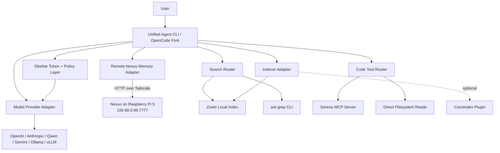

# Fork Decision: OpenCode as Obelisk Base

## Verdict

**Fork OpenCode as the base.** Specifically, the official `anomalyco/opencode` line, not the random similarly named repos floating around like loose bolts under a dashboard.

Why: it is terminal-first, TypeScript-heavy, MIT licensed, has first-class plugin loading, MCP support, model-provider flexibility through AI SDK / Models.dev, built-in session/server modes, project config, custom agents, and enough community gravity that you are not building on a haunted shed. OpenCode's docs show project config, custom config directories, plugins, MCP management, headless `serve`, `run`, sessions, stats, and model/provider handling. ([OpenCode][1])

**Second-best: Qwen Code.** It is also TypeScript, Apache-2.0, actively maintained, and already has Auto-Memory, Auto-Skills, SubAgents, Agent Teams, MCP, daemon mode, SDKs, and multi-provider support. That is dangerously close to what you want, which is annoying because apparently good engineering decisions sometimes exist. But it is more opinionated around Qwen's ecosystem and has more built-in machinery to untangle. ([GitHub][2])

**Do not use Kilo Code as the base.** Kilo is useful, but its CLI is itself a fork of OpenCode, wrapped into a broader agentic engineering platform with VS Code, JetBrains, model marketplace, autocomplete, MCP marketplace, and CI/CD layers. Forking Kilo means inheriting someone else's OpenCode fork plus platform assumptions. That is one extra swamp for no good reason. ([GitHub][3])

---

## 1. Fork candidate evaluation

### Weighted decision matrix

Scores are out of 10. Weighted score is out of 100.

| Candidate      | Architecture | Extensibility | Provider flexibility | Repo/code workflow | Maturity/activity | License | Fork ease | Unified CLI fit | Weighted score |
| -------------- | -----------: | ------------: | -------------------: | -----------------: | ----------------: | ------: | --------: | --------------: | -------------: |
| **OpenCode**   |            9 |             9 |                    9 |                  8 |                10 |      10 |         8 |              10 |         **90** |
| **Qwen Code**  |            9 |             9 |                    9 |                  9 |                 8 |      10 |         7 |               8 |         **86** |
| **Codex CLI**  |            8 |             7 |                    6 |                  9 |                 9 |      10 |         7 |               7 |         **78** |
| **Gemini CLI** |            8 |             8 |                    6 |                  8 |                 8 |      10 |         7 |               7 |         **77** |
| **Aider**      |            7 |             6 |                    9 |                  8 |                 8 |      10 |         7 |               6 |         **73** |
| **Kilo Code**  |            8 |             8 |                    9 |                  9 |                 8 |      10 |         5 |               6 |         **72** |
| **OpenHands**  |            8 |             8 |                    8 |                  8 |                 8 |      10 |         5 |               5 |         **70** |

### Scoring weights

| Criterion                            | Weight |
| ------------------------------------ | -----: |
| CLI architecture quality             |     14 |
| Plugin/MCP/tool extensibility        |     16 |
| Model provider flexibility           |     10 |
| Coding-agent workflow support        |     14 |
| Repo inspection/search suitability   |     10 |
| Maturity/community/release activity  |     12 |
| License compatibility                |      8 |
| Ease of forking                      |      8 |
| Fit for your unified local-first CLI |      8 |

### Candidate notes

#### OpenCode

OpenCode is the best foundation because it already has the shape you need: terminal UI, non-interactive `run`, headless `serve`, sessions, custom agents, MCP, plugins, project config, stats, model selection, and a TypeScript ecosystem. Its official repo is MIT licensed, has very high adoption, and the docs show provider/model support through AI SDK and Models.dev with 75+ providers. ([GitHub][4])

Best use: **main fork base / agent shell / orchestration host.**

Weakness: you still need to build proper memory routing, tool scoring, Obelisk policy enforcement, and first-class code-indexing commands. But that is the right kind of work. It is yours, not inherited spaghetti.

#### Qwen Code

Qwen Code is extremely tempting. It already includes Auto-Memory, Auto-Skills, SubAgents, Agent Teams, MCP, Plan Mode, LSP, sandboxing, Git worktrees, headless mode, daemon mode, SDKs, and multi-provider support. Its docs expose a detailed MCP discovery/execution architecture, including stdio, SSE, and streamable HTTP transports. ([GitHub][2])

Best use: **second-best fork base, or optional delegated subagent runtime.**

Weakness: more opinionated, more moving parts, and more tied to Qwen's ecosystem. Good base if you want fastest feature parity with Claude Code-style workflows. Less good if you want a clean, controlled architecture around your own Nexus/Obelisk system.

#### Kilo Code

Kilo has useful agent modes, MCP marketplace, model switching, autonomous `kilo run --auto`, and broad IDE/platform ambition. But the repo itself says Kilo CLI came from OpenCode. ([GitHub][3])

Best use: **reference implementation / feature donor / compatibility target.**

Do not fork it as the root. Forking a fork as your base is how software projects become archaeological digs.

#### Aider

Aider is mature, terminal-native, Apache-2.0, model-flexible, and excellent at Git-centered edits. It maps the codebase, supports many languages, auto-commits, and works with many local/cloud models. ([GitHub][5])

Best use: **reference for Git workflows and repo maps.**

Weakness: Python-first and less naturally suited to your TypeScript plugin/adapter architecture.

#### Gemini CLI

Gemini CLI is Apache-2.0, TypeScript, terminal-first, MCP-capable, supports file/shell/web tools, and uses a ReAct loop with local or remote MCP servers. ([GitHub][6])

Best use: **reference for ReAct loop, MCP, and Google model integration.**

Weakness: Google/Gemini-centered. Not ideal as the neutral base for a multi-provider, local-first CLI.

#### Codex CLI

Codex CLI is Apache-2.0 and runs locally in the terminal, but it is naturally OpenAI-centered even if forks can extend it. ([GitHub][7])

Best use: **reference for local coding-agent UX and Git/app workflows.**

Weakness: less ideal than OpenCode or Qwen Code for your multi-provider, multi-tool, remote-memory foundation.

#### OpenHands

OpenHands is powerful, but it is more of a self-hosted agent control center and backend platform than a clean terminal-first fork base. It can run agents locally, remotely, in Docker, or through other backends. ([GitHub][8])

Best use: **future remote automation backend, not CLI base.**

---

## 2. Recommended foundation

### Best fork target

**Fork OpenCode.**

Use it as:

| Layer               | Choice                                                   |
| ------------------- | -------------------------------------------------------- |
| CLI shell           | OpenCode fork                                            |
| Primary language    | TypeScript                                               |
| Tool protocol       | Native adapters + MCP                                    |
| Memory              | Remote Nexus API over Tailscale                          |
| Token policy        | Obelisk native adapter in model-call pipeline            |
| Semantic tools      | Serena MCP                                               |
| Fast text search    | Zoekt local daemon/subprocess                            |
| Structural refactor | ast-grep subprocess first, Node binding later            |
| Index/sync          | Local indexes first, CocoIndex as future optional plugin |

### Second-best option

**Qwen Code is preferable if your top priority is fastest feature-packed MVP** and you are willing to reshape its existing memory/skills/agent-team machinery around Nexus and Obelisk.

Use Qwen Code if you want:

- Auto-memory now.
- Subagents now.
- Agent teams now.
- Daemon/SDK/IM integrations now.
- Less foundational architecture work.

Use OpenCode if you want:

- Cleaner ownership.
- Better neutral base.
- Simpler plugin strategy.
- Less ecosystem bias.
- Better long-term control.

My recommendation: **OpenCode base, Qwen Code as an optional delegated runtime later.**

---

## 3. Unified CLI target product

Working name, because everything needs a name before humans will take it seriously:

**Obelisk Agent CLI**
A local-first AI coding CLI that combines:

- OpenCode-derived terminal agent shell.
- Remote Nexus memory over Tailscale.
- Obelisk prompt/token/control policy.
- Serena semantic code intelligence.
- Zoekt indexed code search.
- ast-grep structural search/refactor.
- Optional CocoIndex ingestion/sync layer.

### Core product idea

The CLI should behave like this:

```bash
agent init
agent nexus health
agent run "add password reset flow"
agent search "where is auth handled?"
agent semantic refs UserService
agent ast find "await $CALL($ARGS)"
agent budget inspect
agent memory remember "This repo uses Prisma and Next.js app router"
```

Underneath, OpenCode supplies the interaction/session/model/tool skeleton. Your fork adds a **routing brain** that decides when to ask memory, when to use code search, when to use semantic tools, when to use ast-grep, and when to refuse because Obelisk says the token budget or policy is cooked.

---

## 4. Remote Nexus memory architecture over Tailscale

### Network assumption

Nexus memory server:

```txt
http://100.68.0.96:7777
```

Accessible through Tailscale.

Tailscale uses WireGuard for encrypted device-to-device transport, and its ACLs/grants follow least-privilege / deny-by-default policy design. So the tailnet gives you encrypted transport, but it is not a substitute for API authentication. Apparently one lock is not enough. Shocking. ([Tailscale][9])

### Connection behavior

The CLI should have a `RemoteNexusMemoryAdapter` with:

| Behavior                 | Recommendation                                                     |
| ------------------------ | ------------------------------------------------------------------ |
| Health check             | `GET /health` before session start                                 |
| Timeout                  | 1.5s health, 5s read, 8s write                                     |
| Retry                    | 3 attempts, exponential backoff: 250ms, 750ms, 1500ms              |
| Auth                     | `Authorization: Bearer $NEXUS_API_KEY`                             |
| Offline fallback         | Local SQLite/JSONL queue under `.agent/cache/memory-outbox.sqlite` |
| Reconnect                | Background retry during active session every 60s                   |
| Circuit breaker          | Disable remote writes for 5 min after repeated failure             |
| Persistence verification | Write memory, read by ID, then search by test tag                  |
| Project identity         | Hash of repo remote URL + root path + Git origin                   |

### Memory scopes

| Memory type             |             Stored in Nexus? | Notes                                          |
| ----------------------- | ---------------------------: | ---------------------------------------------- |
| User preferences        |                          Yes | Small, durable, cross-project                  |
| Project memory          |                          Yes | Summaries, conventions, architecture notes     |
| Session memory          |              Yes, summarized | Do not store full raw transcripts by default   |
| Repo summaries          |                          Yes | Generated summaries, not whole repo by default |
| Architectural decisions |                          Yes | ADR-style records                              |
| Task history            |                          Yes | Goal, files touched, result, tests             |
| Embeddings              | Prefer Nexus for memory text | Code embeddings can stay local initially       |
| Raw source files        |                No by default | Keep local unless explicitly enabled           |
| Secrets / `.env` / keys |                        Never | Redact and block                               |

### Local vs remote

| Keep local                   | Send to Nexus                        |
| ---------------------------- | ------------------------------------ |
| Full source tree             | File summaries                       |
| `.env`, secrets, credentials | Redacted config facts only           |
| Git diff before approval     | Final task summary after completion  |
| Local Zoekt index            | Search result snippets when relevant |
| ast-grep rewrite preview     | Accepted refactor summary            |
| Temporary agent scratchpad   | Durable decisions and preferences    |
| Full session transcript      | Compacted session memory             |

### Mermaid architecture



---

## 5. Security design

### Tailscale ACL example

Use a tag for the Pi:

```jsonc
{
  "tagOwners": {
    "tag:nexus": ["autogroup:admin"],
    "tag:dev-client": ["autogroup:admin"]
  },
  "grants": [
    {
      "src": ["tag:dev-client"],
      "dst": ["tag:nexus:7777"],
      "ip": ["tcp"]
    }
  ]
}
```

If you do not use tags yet, restrict by user or device IP. Tailscale docs say `100.x.y.z` addresses can be used in policies, so your Pi address can be used directly if needed. ([Tailscale][10])

```jsonc
{
  "acls": [
    {
      "action": "accept",
      "src": ["dylan@example.com"],
      "dst": ["100.68.0.96:7777"]
    }
  ]
}
```

### Pi firewall

On the Raspberry Pi:

```bash
sudo ufw default deny incoming
sudo ufw allow in on tailscale0 to any port 7777 proto tcp
sudo ufw enable
```

Or with `nftables`, only allow `tailscale0`.

### Service binding

Best options:

| Option                                      | Recommendation                                                                     |
| ------------------------------------------- | ---------------------------------------------------------------------------------- |
| Bind Nexus to `127.0.0.1` + Tailscale Serve | Most controlled                                                                    |
| Bind Nexus to `100.68.0.96` only            | Good                                                                               |
| Bind Nexus to `0.0.0.0`                     | Avoid unless firewall is perfect, which it won't be, because reality enjoys comedy |

If using plain HTTP over Tailscale, transport is already encrypted by WireGuard. Still use API keys. For extra defense, use HTTPS via Tailscale Serve, Caddy, or a tailnet cert.

### Encryption at rest

On Pi:

- Store Nexus DB on encrypted disk or LUKS partition if practical.
- If using SQLite, consider SQLCipher.
- Encrypt backups with `age`.
- Keep API keys out of Git.
- Rotate memory API key.
- Add per-project permission boundaries.

---

## 6. Integration architecture

| Component     | Integration style                                     | Why                                                                      |
| ------------- | ----------------------------------------------------- | ------------------------------------------------------------------------ |
| OpenCode base | Native fork                                           | Main CLI/session/model shell                                             |
| Nexus memory  | Native TypeScript HTTP adapter + optional MCP wrapper | Needs to affect context assembly before model calls                      |
| Obelisk       | Native module/package                                 | Must sit in prompt assembly, budgeting, policy, and model-call path      |
| Serena        | MCP server                                            | Serena is designed as MCP semantic code toolkit ([GitHub][11])           |
| Zoekt         | Local daemon or subprocess                            | Fast indexed search; Go binary/service is fine                           |
| ast-grep      | Subprocess first, Node NAPI later                     | CLI is stable, fast, MIT, Rust-based ([GitHub][12])                      |
| CocoIndex     | Optional plugin/daemon later                          | Great for incremental AI indexing, but not needed for MVP ([GitHub][13]) |
| Qwen CLI      | Optional delegated agent via SDK/daemon/ACP later     | Do not merge into core                                                   |
| Kilo          | Reference only                                        | Fork of OpenCode, not base                                               |

---

## 7. Unified command design

Use `agent` as placeholder binary. Replace with your final name later, ideally before branding consumes your soul.

### Project setup

```bash
agent init
agent init --with-nexus --with-serena --with-zoekt --with-ast-grep
agent doctor
```

### Nexus config

```bash
agent nexus config set endpoint http://100.68.0.96:7777
agent nexus config set api-key-env NEXUS_API_KEY
agent nexus health
agent nexus ping
agent nexus test-write
agent nexus sync
agent nexus offline-status
```

### Tailscale checks

```bash
agent tailnet status
agent tailnet ping 100.68.0.96
agent tailnet check nexus
```

Internally:

```bash
tailscale status --json
tailscale ping 100.68.0.96
curl -fsS http://100.68.0.96:7777/health
```

### Indexing

```bash
agent index
agent index zoekt
agent index zoekt --rebuild
agent index status
agent index watch
```

### Agent sessions

```bash
agent run "add email verification"
agent run --plan "inspect auth architecture"
agent run --continue
agent run --model anthropic/claude-sonnet-4-5
agent run --offline
```

### Search

```bash
agent search "password reset"
agent search --regex "createUser\\("
agent zoekt query "auth provider"
```

### ast-grep

```bash
agent ast find --lang ts --pattern "await $CALL($ARGS)"
agent ast rewrite --lang ts --pattern "var $A = $B" --rewrite "let $A = $B"
agent ast scan
```

### Serena

```bash
agent semantic symbols
agent semantic find-symbol UserService
agent semantic refs UserService.createUser
agent semantic rename oldName newName
agent semantic status
```

### Memory

```bash
agent memory remember "This repo uses Prisma migrations manually"
agent memory recall "database migration rules"
agent memory decisions
agent memory task-history
agent memory forget "old deploy flow"
```

### Obelisk

```bash
agent budget inspect
agent budget explain
agent budget set --max-input 120000 --reserve-output 12000
agent policy show
agent policy test "can edit .env?"
```

### Models

```bash
agent models list
agent models providers
agent models set default anthropic/claude-sonnet-4-5
agent models set fast qwen/qwen-coder
agent models set local ollama/qwen2.5-coder
```

---

## 8. Agent orchestration loop

### Execution loop

```txt
1. Load project config
2. Health-check Nexus
3. Load local session state
4. Ask Obelisk for budget + policy envelope
5. Classify user task
6. Retrieve memory if useful
7. Select tools
8. Build compact prompt
9. Run model/tool loop
10. Validate changes
11. Summarize result
12. Save durable memory/task history
13. Queue offline memory if Nexus failed
```

### Routing logic

| Situation                          | Tool                                   |
| ---------------------------------- | -------------------------------------- |
| User asks about prior decisions    | Nexus                                  |
| User asks "where is X?"           | Zoekt first                            |
| User asks symbol refs/rename       | Serena                                 |
| User asks large refactor pattern   | ast-grep                               |
| User asks broad architecture       | Nexus + Zoekt + Serena                 |
| User asks to edit small known file | Direct filesystem read                 |
| Context budget too high            | Obelisk compacts / blocks / summarizes |
| Repo changed since last run        | Zoekt reindex or CocoIndex later       |
| Need semantic code chunks          | Serena                                 |
| Need literal speed                 | Zoekt                                  |
| Need safe codemod                  | ast-grep                               |
| Need durable facts saved           | Nexus                                  |
| Nexus offline                      | Local memory outbox                    |

### Examples

#### "Where is auth handled?"

1. Zoekt query: `auth login session user token`
2. Serena symbol lookup: `AuthService`, `middleware`, `session`
3. Direct reads of top 5 files.
4. Obelisk packs only relevant snippets.

#### "Rename `createUser` to `registerUser` safely"

1. Serena finds symbol and refs.
2. ast-grep checks structural usages.
3. Direct file edits or Serena refactor.
4. Tests run.
5. Nexus saves task summary.

#### "Continue the billing integration from last time"

1. Nexus recall: project decisions + task history.
2. Zoekt search: billing/Stripe files.
3. Obelisk builds context.
4. Agent plans before editing.

---

## 9. Repo/module structure

```txt
unified-agent-cli/
  apps/
    cli/
      src/
        commands/
        tui/
        main.ts
    mcp-server/
      src/
        nexus-tools.ts
        obelisk-tools.ts

  packages/
    core/
      src/
        agent/
          AgentRuntime.ts
          Orchestrator.ts
          ToolRouter.ts
        config/
          ConfigLoader.ts
          schema.ts
        events/
        sessions/

    adapters/
      memory/
        MemoryAdapter.ts
        RemoteNexusMemoryAdapter.ts
        LocalMemoryCache.ts
      search/
        SearchAdapter.ts
        ZoektSearchAdapter.ts
      semantic/
        SemanticCodeAdapter.ts
        SerenaMcpAdapter.ts
      structural/
        StructuralRefactorAdapter.ts
        AstGrepAdapter.ts
      token-control/
        TokenControlAdapter.ts
        ObeliskAdapter.ts
      indexer/
        IndexerAdapter.ts
        ZoektIndexerAdapter.ts
        CocoIndexAdapter.ts
      models/
        ModelProviderAdapter.ts
        OpenCodeModelAdapter.ts

    plugins/
      src/
        PluginManifest.ts
        PluginLoader.ts

    security/
      src/
        Redactor.ts
        PermissionPolicy.ts
        SecretScanner.ts

    shared/
      src/
        types.ts
        Result.ts
        logger.ts

  examples/
    configs/
    tailscale/
    plugins/

  docs/
    architecture.md
    nexus-memory.md
    adapters.md
    security.md
```

### Adapter interfaces

```ts
export interface MemoryAdapter {
  health(): Promise<HealthStatus>;
  remember(input: MemoryWrite): Promise<MemoryRecord>;
  recall(query: MemoryQuery): Promise<MemoryRecord[]>;
  get(id: string): Promise<MemoryRecord | null>;
  forget(queryOrId: string): Promise<void>;
  saveTaskHistory(task: TaskHistory): Promise<void>;
  saveDecision(decision: ArchitecturalDecision): Promise<void>;
  syncOfflineQueue(): Promise<SyncResult>;
}
```

```ts
export interface SearchAdapter {
  index(repoPath: string, options?: IndexOptions): Promise<void>;
  search(query: SearchQuery): Promise<SearchResult[]>;
  status(repoPath: string): Promise<IndexStatus>;
}
```

```ts
export interface SemanticCodeAdapter {
  listSymbols(file?: string): Promise<SymbolInfo[]>;
  findSymbol(name: string): Promise<SymbolInfo[]>;
  findReferences(symbol: string): Promise<Reference[]>;
  renameSymbol(input: RenameInput): Promise<EditPlan>;
}
```

```ts
export interface StructuralRefactorAdapter {
  find(pattern: AstPattern): Promise<AstMatch[]>;
  rewrite(input: RewritePattern): Promise<RewritePreview>;
  apply(previewId: string): Promise<ApplyResult>;
}
```

```ts
export interface TokenControlAdapter {
  inspect(input: ContextCandidate): Promise<TokenReport>;
  assemble(input: PromptAssemblyInput): Promise<PromptAssemblyResult>;
  enforcePolicy(action: AgentAction): Promise<PolicyDecision>;
}
```

```ts
export interface IndexerAdapter {
  init(repoPath: string): Promise<void>;
  update(repoPath: string): Promise<IndexUpdateResult>;
  watch(repoPath: string): AsyncIterable<IndexEvent>;
}
```

```ts
export interface ModelProviderAdapter {
  listModels(): Promise<ModelInfo[]>;
  complete(input: ModelRequest): Promise<ModelResponse>;
  stream(input: ModelRequest): AsyncIterable<ModelEvent>;
}
```

---

## 10. Remote Nexus client pseudocode

Assumed API. Adjust endpoint paths to your real Nexus service because APIs, like humans, rarely arrive tidy.

```ts
type NexusConfig = {
  endpoint: string;
  apiKey: string;
  timeoutMs: number;
  retries: number;
  offlineCachePath: string;
};

export class RemoteNexusMemoryAdapter implements MemoryAdapter {
  constructor(
    private config: NexusConfig,
    private offline: LocalMemoryCache,
  ) {}

  private async request<T>(
    path: string,
    init: RequestInit = {},
    timeoutMs = this.config.timeoutMs,
  ): Promise<T> {
    const url = `${this.config.endpoint}${path}`;
    let lastError: unknown;

    for (let attempt = 0; attempt <= this.config.retries; attempt++) {
      const controller = new AbortController();
      const timer = setTimeout(() => controller.abort(), timeoutMs);

      try {
        const res = await fetch(url, {
          ...init,
          signal: controller.signal,
          headers: {
            "content-type": "application/json",
            "authorization": `Bearer ${this.config.apiKey}`,
            ...(init.headers ?? {}),
          },
        });

        if (!res.ok) {
          throw new Error(`Nexus ${res.status}: ${await res.text()}`);
        }

        return await res.json() as T;
      } catch (err) {
        lastError = err;
        await sleep([250, 750, 1500][attempt] ?? 1500);
      } finally {
        clearTimeout(timer);
      }
    }

    throw lastError;
  }

  async health(): Promise<HealthStatus> {
    return this.request<HealthStatus>("/health", { method: "GET" }, 1500);
  }

  async remember(input: MemoryWrite): Promise<MemoryRecord> {
    try {
      return await this.request<MemoryRecord>("/v1/memory", {
        method: "POST",
        body: JSON.stringify(input),
      });
    } catch (err) {
      await this.offline.queueMemoryWrite(input);
      return {
        id: `offline-${Date.now()}`,
        status: "queued",
        content: input.content,
        scope: input.scope,
      } as MemoryRecord;
    }
  }

  async recall(query: MemoryQuery): Promise<MemoryRecord[]> {
    try {
      return await this.request<MemoryRecord[]>("/v1/memory/search", {
        method: "POST",
        body: JSON.stringify(query),
      });
    } catch {
      return this.offline.search(query);
    }
  }

  async get(id: string): Promise<MemoryRecord | null> {
    return this.request<MemoryRecord | null>(`/v1/memory/${id}`);
  }

  async forget(queryOrId: string): Promise<void> {
    await this.request("/v1/memory/forget", {
      method: "POST",
      body: JSON.stringify({ queryOrId }),
    });
  }

  async saveTaskHistory(task: TaskHistory): Promise<void> {
    await this.remember({
      scope: "task_history",
      content: JSON.stringify(task),
      tags: ["task", task.projectId],
    });
  }

  async saveDecision(decision: ArchitecturalDecision): Promise<void> {
    await this.remember({
      scope: "architecture_decision",
      content: JSON.stringify(decision),
      tags: ["adr", decision.projectId],
    });
  }

  async syncOfflineQueue(): Promise<SyncResult> {
    const queued = await this.offline.pendingWrites();
    let synced = 0;

    for (const item of queued) {
      await this.request("/v1/memory", {
        method: "POST",
        body: JSON.stringify(item),
      });
      await this.offline.markSynced(item.localId);
      synced++;
    }

    return { synced, remaining: queued.length - synced };
  }
}
```

---

## 11. Example config

### `agent.config.jsonc`

```jsonc
{
  "$schema": "https://your-cli.dev/schema/agent.config.json",

  "project": {
    "name": "my-project",
    "root": ".",
    "localFirst": true
  },

  "nexus": {
    "enabled": true,
    "endpoint": "http://100.68.0.96:7777",
    "transport": "tailscale",
    "apiKeyEnv": "NEXUS_API_KEY",
    "healthPath": "/health",
    "timeoutMs": 5000,
    "healthTimeoutMs": 1500,
    "retries": 3,
    "retryBackoffMs": [250, 750, 1500],
    "offlineCachePath": ".agent/cache/memory-outbox.sqlite",
    "syncOnReconnect": true
  },

  "obelisk": {
    "enabled": true,
    "maxInputTokens": 120000,
    "reserveOutputTokens": 12000,
    "maxToolResultTokens": 24000,
    "contextPolicy": "compact-first",
    "denySecretFiles": true,
    "requireApprovalForDangerousCommands": true
  },

  "tools": {
    "serena": {
      "enabled": true,
      "mode": "mcp",
      "command": "uvx",
      "args": ["--from", "git+https://github.com/oraios/serena", "serena", "start-mcp-server"]
    },
    "zoekt": {
      "enabled": true,
      "mode": "subprocess",
      "indexPath": ".agent/index/zoekt",
      "autoIndex": true
    },
    "astGrep": {
      "enabled": true,
      "mode": "subprocess",
      "binary": "ast-grep"
    },
    "cocoIndex": {
      "enabled": false,
      "mode": "plugin",
      "purpose": "future-incremental-sync"
    }
  },

  "models": {
    "default": "anthropic/claude-sonnet-4-5",
    "fast": "qwen/qwen-coder",
    "local": "ollama/qwen2.5-coder",
    "providers": {
      "anthropic": { "apiKeyEnv": "ANTHROPIC_API_KEY" },
      "openai": { "apiKeyEnv": "OPENAI_API_KEY" },
      "qwen": { "apiKeyEnv": "DASHSCOPE_API_KEY" },
      "ollama": { "baseUrl": "http://localhost:11434" }
    }
  }
}
```

### `.env`

```bash
NEXUS_ENDPOINT=http://100.68.0.96:7777
NEXUS_API_KEY=replace_with_long_random_key
NEXUS_TIMEOUT_MS=5000
NEXUS_RETRIES=3
AGENT_OFFLINE_CACHE=.agent/cache/memory-outbox.sqlite

ANTHROPIC_API_KEY=
OPENAI_API_KEY=
DASHSCOPE_API_KEY=
OPENROUTER_API_KEY=

OBELISK_MAX_INPUT_TOKENS=120000
OBELISK_RESERVE_OUTPUT_TOKENS=12000
COCOINDEX_DISABLE_USAGE_TRACKING=1
```

---

## 12. CocoIndex decision

**Do not put CocoIndex in v1 core.**

Use it later as an **optional indexing/sync plugin**, not the primary indexer.

Why:

- Zoekt already solves fast exact indexed code search.
- ast-grep already solves structural search/refactor.
- Serena already solves semantic symbol-level code operations.
- CocoIndex is valuable for incremental AI indexing, semantic code RAG, lineage, and always-fresh data pipelines, but adding it in v1 increases moving parts. CocoIndex itself positions around incremental data transformation for AI workloads, codebase chunking, embeddings, vector stores, and real-time/near-real-time indexing. ([GitHub][13])

Best future use:

| CocoIndex role         | Recommendation                   |
| ---------------------- | -------------------------------- |
| Primary indexing layer | No, too much for v1              |
| Sync layer             | Maybe v2                         |
| Ingestion layer        | Yes, later                       |
| Optional future plugin | **Yes**                          |
| Not used               | No, it is useful, just not first |

Use it when you want:

- Shared semantic code index.
- Incremental embeddings.
- Branch-aware indexing.
- Code RAG over multiple repos.
- Nexus memory enrichment from repo changes.

---

## 13. Implementation roadmap

### Phase 1: Fork evaluation

| Item         | Details                                                                                                                 |
| ------------ | ----------------------------------------------------------------------------------------------------------------------- |
| Goal         | Confirm OpenCode fork is technically clean                                                                              |
| Tasks        | Clone OpenCode, Qwen Code, Kilo; inspect CLI command registration, config loading, tool system, model calls, session DB |
| Dependencies | Node 22+, Bun/npm, Git                                                                                                  |
| Success      | You can run OpenCode locally from source and add one dummy command                                                      |
| Risk         | Upstream churn                                                                                                          |

### Phase 2: Minimal fork

| Item         | Details                                                         |
| ------------ | --------------------------------------------------------------- |
| Goal         | Rename binary and preserve upstream functionality               |
| Tasks        | Change package name, command name, config paths, branding, docs |
| Dependencies | OpenCode build passing                                          |
| Success      | `agent run "hello"` works                                       |
| Risk         | Breaking update paths                                           |

### Phase 3: Remote Nexus memory client

| Item         | Details                                                                    |
| ------------ | -------------------------------------------------------------------------- |
| Goal         | Connect to Pi memory server over Tailscale                                 |
| Tasks        | Add `RemoteNexusMemoryAdapter`, config, health command, test-write command |
| Dependencies | Nexus server reachable at `100.68.0.96:7777`                               |
| Success      | Health, write, read, search, offline fallback                              |
| Risk         | Unknown Nexus API schema                                                   |

### Phase 4: Search integration

| Item         | Details                                                              |
| ------------ | -------------------------------------------------------------------- |
| Goal         | Add Zoekt-backed indexed search                                      |
| Tasks        | Install/index/search commands, result formatting, Obelisk compaction |
| Dependencies | Zoekt binary                                                         |
| Success      | `agent search "auth"` returns ranked local results                   |
| Risk         | Index invalidation                                                   |

### Phase 5: Semantic tools

| Item         | Details                                                                  |
| ------------ | ------------------------------------------------------------------------ |
| Goal         | Add Serena MCP                                                           |
| Tasks        | Managed MCP config, lifecycle checks, semantic commands                  |
| Dependencies | Python/uv/Serena                                                         |
| Success      | Find symbols/references                                                  |
| Risk         | Language server weirdness, because language servers are tiny bureaucrats |

### Phase 6: Structural refactor

| Item         | Details                                  |
| ------------ | ---------------------------------------- |
| Goal         | Add ast-grep                             |
| Tasks        | `ast find`, `ast rewrite`, preview/apply |
| Dependencies | ast-grep installed                       |
| Success      | Safe codemod preview                     |
| Risk         | Bad rewrite patterns                     |

### Phase 7: Obelisk integration

| Item         | Details                                               |
| ------------ | ----------------------------------------------------- |
| Goal         | Token budgeting and policy enforcement                |
| Tasks        | Wrap prompt assembly, model call, tool result packing |
| Dependencies | Obelisk API/package                                   |
| Success      | Budget report before expensive tasks                  |
| Risk         | Too much policy friction                              |

### Phase 8: Unified orchestration

| Item         | Details                                                     |
| ------------ | ----------------------------------------------------------- |
| Goal         | Tool router makes intelligent choices                       |
| Tasks        | Classifier, routing rules, memory retrieval, context packer |
| Dependencies | Previous adapters                                           |
| Success      | Agent chooses Nexus/Serena/Zoekt/ast-grep correctly         |
| Risk         | Tool overuse                                                |

### Phase 9: Advanced autonomous workflows

| Item         | Details                                             |
| ------------ | --------------------------------------------------- |
| Goal         | Long-running tasks, background agents, worktrees    |
| Tasks        | Task planner, checkpoints, recovery, scheduled runs |
| Dependencies | Stable core                                         |
| Success      | Multi-step repo task with resumable state           |
| Risk         | Safety and runaway costs                            |

---

## 14. First 10 engineering steps

1. **Clone candidates.**

```bash
mkdir -p ~/agent-cli-eval && cd ~/agent-cli-eval
git clone https://github.com/anomalyco/opencode.git
git clone https://github.com/QwenLM/qwen-code.git
git clone https://github.com/kilo-org/kilocode.git
git clone https://github.com/aider-ai/aider.git
```

2. **Inspect licenses and dependency constraints.**

```bash
find . -maxdepth 2 -iname "LICENSE*" -o -iname "package.json" -o -iname "pyproject.toml"
```

3. **Run OpenCode from source.**

Inspect:

```txt
package.json
packages/
apps/
src command registration
config loader
plugin loader
MCP config handling
model provider abstraction
session storage
tool registry
```

4. **Add a dummy command to OpenCode.**

Target:

```bash
agent nexus health
```

Initially return static text.

5. **Create config schema extension.**

Add:

```jsonc
{
  "nexus": {
    "endpoint": "http://100.68.0.96:7777",
    "apiKeyEnv": "NEXUS_API_KEY"
  }
}
```

6. **Build `RemoteNexusMemoryAdapter`.**

Implement:

```txt
health()
remember()
recall()
get()
syncOfflineQueue()
```

7. **POC Tailscale health check.**

```bash
tailscale status
tailscale ping 100.68.0.96
curl -fsS http://100.68.0.96:7777/health
```

8. **POC memory persistence.**

```bash
agent nexus test-write --content "nexus integration test $(date -Is)"
agent memory recall "nexus integration test"
```

9. **Add failure handling.**

Test by pointing endpoint to a dead port:

```bash
agent nexus config set endpoint http://100.68.0.96:7778
agent nexus test-write
agent nexus offline-status
```

Expected: write queues locally, CLI does not crash.

10. **Only then add Zoekt.**

Do not start with Serena/CocoIndex. First prove the foundation: command → config → Nexus → offline fallback → session context injection.

---

## 15. First POC spec

### POC goal

Prove the forked CLI can:

1. Connect to Nexus at `100.68.0.96:7777`.
2. Health check over Tailscale.
3. Write test memory.
4. Retrieve by ID.
5. Search by query/tag.
6. Verify persistence after process restart.
7. Fail gracefully when Nexus is unreachable.

### POC commands

```bash
agent nexus health --endpoint http://100.68.0.96:7777

agent memory remember \
  --scope project \
  --tag poc \
  --content "POC memory from unified CLI over Tailscale"

agent memory recall "POC memory from unified CLI"

agent nexus verify-persistence --tag poc
```

### Failure test

```bash
agent nexus config set endpoint http://100.68.0.96:9999
agent memory remember --scope session --content "offline queue test"
agent memory offline-status

agent nexus config set endpoint http://100.68.0.96:7777
agent memory sync
```

Expected:

```txt
Nexus unavailable. Memory write queued locally.
Remote Nexus reconnected.
1 queued memory synced.
```

---

## Final practical recommendation

Build this in this order:

1. **Fork OpenCode.**
2. **Rename and stabilize the CLI.**
3. **Add Nexus remote memory as a native adapter.**
4. **Add Obelisk as a native policy/token layer before model calls.**
5. **Add Zoekt search.**
6. **Add ast-grep refactor.**
7. **Add Serena MCP.**
8. **Keep CocoIndex disabled until v2.**
9. **Treat Qwen Code as an optional delegated agent later.**
10. **Ignore Kilo as a base. Use it only for feature ideas.**

The key architectural rule: **OpenCode is the shell, Nexus is the memory, Obelisk is the governor, Serena is the semantic IDE brain, Zoekt is the fast index, ast-grep is the surgical refactor tool, CocoIndex is future ingestion plumbing.**

That is the cleanest path that does not turn your CLI into seven projects in a trench coat.

[1]: https://opencode.ai/docs/config/ "Config | OpenCode"
[2]: https://github.com/QwenLM/qwen-code "GitHub - QwenLM/qwen-code: An open-source AI coding agent that lives in your terminal."
[3]: https://github.com/kilo-org/kilocode "GitHub - Kilo-Org/kilocode: Kilo is the all-in-one agentic engineering platform."
[4]: https://github.com/anomalyco/opencode "GitHub - anomalyco/opencode: The open source coding agent."
[5]: https://github.com/aider-ai/aider "GitHub - Aider-AI/aider: aider is AI pair programming in your terminal."
[6]: https://github.com/google-gemini/gemini-cli "GitHub - google-gemini/gemini-cli: An open-source AI agent that brings the power of Gemini directly into your terminal."
[7]: https://github.com/openai/codex "openai/codex: Lightweight coding agent that runs in your ..."
[8]: https://github.com/OpenHands/openhands "GitHub - OpenHands/OpenHands: OpenHands: AI-Driven Development"
[9]: https://tailscale.com/docs/concepts/what-is-tailscale "What is Tailscale?"
[10]: https://tailscale.com/docs/reference/reserved-ip-addresses "Reserved IP addresses - Tailscale Docs"
[11]: https://github.com/oraios/serena "GitHub - oraios/serena: A powerful MCP toolkit for coding, providing semantic retrieval and editing capabilities"
[12]: https://github.com/ast-grep/ast-grep "GitHub - ast-grep/ast-grep: A CLI tool for code structural search, lint and rewriting. Written in Rust."
[13]: https://github.com/cocoindex-io/cocoindex "GitHub - cocoindex-io/cocoindex: Incremental engine for long horizon agents"